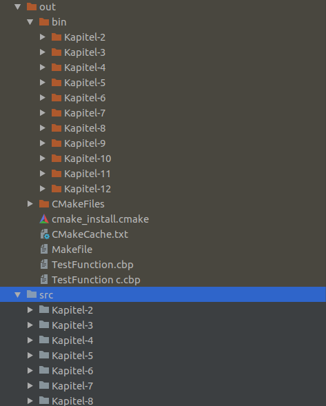

# CMakeLists-For-Books

A CMakeLists.txt for build book exercises.



## Getting Started

Copy the CMakeLists.txt into your project. After that customize the global variables in the CMakeLists.txt. 
<br>
Next create an output folder and run the following commands.
```bash
 cd myOutputFolder
 cmake ..
 make
 ```
 After that you get the structure in the screenshot.
 You can also choose if you want to get folders like above or just put all executables into the output folder.

## License
This project is licensed under the MIT License - see the LICENSE file for details

## Contributing

#### Step 1

- Fork this repo!
    
#### Step 2

- **HACK AWAY!**

#### Step 3

- Create a new pull request
